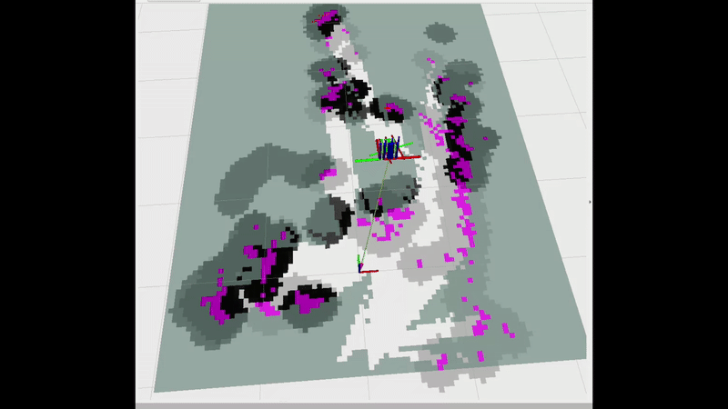
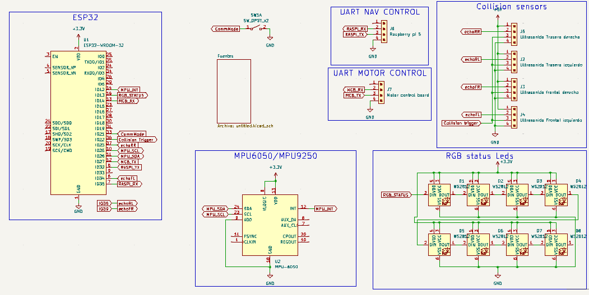
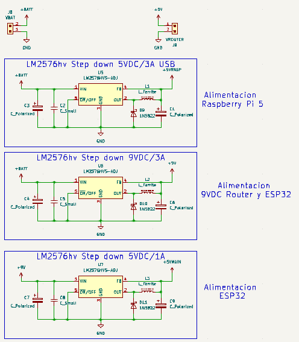

<h1 align="center">Universidad Nacional de Lomas de Zamora - Facultad de Ingeniería</h1>

<h1 align="center">HoverRobot ESP32</h1>

   
  <em>Estabilizacion y control</em>

   
  <em>Navegación autónoma con ROS2</em>

## Introducción / Objetivo

La **Facultad de Ingeniería de la UNLZ** promueve proyectos orientados a la robótica, control y automatización.  
Este repositorio corresponde al **Proyecto Final de Ingeniería Mecatrónica**, cuyo desarrollo se centra en un robot de balanceo autónomo denominado **HoverRobot ESP32**.

El objetivo principal es **convertir la estructura de un hoverboard en una plataforma robótica inteligente**, integrando:

- Un **sistema de control dinámico** basado en **ESP32**.  
- Un **sensor inercial** para mantener el equilibrio.  
- Un módulo de **visión estéreo** basado en una **cámara PS5 + Raspberry Pi 5**.  
- Una **aplicación móvil** para control manual.  

El proyecto explora la interacción entre **estabilidad dinámica**, **visión en tiempo real** y **navegación autónoma** mediante ROS 2.

---

## Índice

- [Descripción](#descripción)
- [Alcance y estado actual](alcance-y-estado-actual)
- [Arquitectura general](#arquitectura-general)
- [Planificación](#planificación)
- [Tecnologías Utilizadas](tecnologias-utilizadas)
- [Listado de Componentes](#listado-de-componentes)
- [Esquemáticos](#esquemáticos)
- [Diseño mecánico y planos](#diseño-mecánico-y-planos)
- [Instrucciones de Uso](#instrucciones-de-uso)  
- [Autor](#autor)  
- [Repositorios Relacionados](#repositorios-relacionados)

---

## Descripción

**HoverRobot** es un robot autoequilibrado que combina electrónica embebida, control dinámico y visión computacional.  
El proyecto nace como una plataforma de estudio para integrar conocimientos de **control**, **electrónica**, **visión artificial**, y **robótica móvil**, culminando en un prototipo **totalmente funcional** y con navegación reactiva para evasión de obstáculos.

---

## Alcance y estado actual

### Objetivos logrados

- Robot de balanceo totalmente funcional.
- Deteccion de profundidad a partir de una camara stereo
- Control manual mediante app móvil.  
- Comunicación estable entre todos los subsistemas.
- Mapeo 2D real mediante SLAM.  
- Navegación basada en visión estéreo. 
- Pruebas en entornos reales con detección de obstáculos.

### Limitaciones actuales y oportunidades de mejora

- El **mapa presenta drift acumulado**, principalmente por la ausencia de un **magnetómetro**, lo que afecta la estabilidad del yaw en la odometría visual.  
- El **campo de visión reducido** de la cámara PS5 limita la cantidad de características detectables, afectando el desempeño del **scan matching de slam_toolbox** y reduciendo la calidad del mapeo.  
- El control basado en PID, aunque funcional, no se adapta automáticamente a variaciones en la dinámica del robot (cambios de peso, centro de gravedad, carga o variaciones en la tracción efectiva de las ruedas). Como mejora futura, podrían evaluarse métodos más robustos como LQR, MPC, control adaptativo o gain scheduling.

---

## Arquitectura general

El sistema se compone de tres subsistemas principales:

### 1. Control de balanceo (ESP32)

- Placa electrónica personalizada con **ESP32**.  
- Lectura de un **IMU MPU6050** para estimar la inclinación del robot.  
- Control directo de los **motores brushless** del hoverboard.  
- Indicadores de estado mediante **WS2812 LEDs**.

### 2. Visión y navegación (Raspberry Pi + ROS 2)

- La **cámara estéreo PS5** captura imágenes del entorno.  
- La **Raspberry Pi 5** procesa la visión y ejecuta nodos ROS 2 para:
  - Rectificación estéreo  
  - Cálculo de disparidad  
  - Conversión a nube de puntos o LaserScan  
  - SLAM con *slam_toolbox*  
  - Planificación y navegación  
- Permite construir un **mapa 2D** del ambiente usando únicamente visión.

### 3. Interfaz y comunicaciones

- **Aplicación móvil en Kotlin** para control manual.  
- Comunicación **TCP** entre Raspberry Pi ↔ ESP32 ↔ App.  
- El robot funciona como **punto de acceso WiFi**, permitiendo conectarse desde una notebook para:
  - **visualizar el mapa en RViz**,  
  - **monitorear datos**,  
  - **lanzar o detener nodos ROS 2**.  

---

## Planificación

### Gantt inicial

  
  <em>Estimacion inicial: 221hs</em>

### Gantt final

  
  <em>Total de horas reales: 230hs + ongoing</em>

Si bien la estimación global fue cercana a la real, algunas tareas puntuales presentaron desvíos significativos debido a problemas técnicos no previstos, cuya resolución demandó más tiempo del estimado inicial.
Estos desvíos se compensaron con otras tareas que resultaron menos complejas de lo esperado.

### Desvío total: +9 h respecto a la estimación inicial

---

## Tecnologías Utilizadas

- **Control y Robótica**: ESP32, controladora hoverboard, motores brushless  
- **Sensado**: IMU MPU6050, cámara estéreo PS5  
- **Computación / Procesamiento**: Raspberry Pi 5, Python, C, Kotlin  
- **Frameworks**: ROS 2 (Jazzy), OpenCV, freeRTOS
- **Comunicación**: TCP sockets, UART  
- **Visión Artificial**: extracción de características, flujo estéreo, navegación basada en percepción  

---

## Listado de Componentes  

### 1. Electrónica del robot (control, regulación, sensores)
| Componente | Cantidad | Precio Unitario (USD) | Precio Total (USD) | Notas |
|-----------|----------|------------------------|---------------------|-------|
| ESP32 (montado en placa custom) | 1 | 8 | 8 | Microcontrolador principal |
| Placa perforada / PCB prototipo (custom) | 1 | 3.5 | 3.5 | Base para montar ESP32, sensores y electrónica |
| IMU MPU6050 | 1 | 2 | 2 | Sensor de aceleración y giroscopio |
| Step Down HV | 2 | 4 | 8 | Regulación de tensión |
| Módulo LED WS2812 (8 LEDs) | 1 | 2 | 2 | Indicador de estado visual |
| Cableado + conectores | — | 10 | 10 | JST, Dupont, termocontraíble, etc. |

### 2. Hardware del robot (estructura y montaje)
| Componente | Cantidad | Precio Unitario (USD) | Precio Total (USD) | Notas |
|-----------|----------|------------------------|---------------------|-------|
| Hoverboard reutilizado | 1 | 30 | 30 | Motores brushless + controladora + Bateria |
| Perfiles de aluminio 40×40×200 | 2 | 3 | 6 | Estructura |
| Base de fibrofacil | 2 | 5 | 10 | Placas de montaje |
| Rollo de filamento PLA 1 kg | 1 | 12 | 12 |  |
| Tornillería variada | — | 10 | 10 | Ensamblaje |

### 3. Computadora, visión y periféricos
| Componente | Cantidad | Precio Unitario (USD) | Precio Total (USD) | Notas |
|-----------|----------|------------------------|---------------------|-------|
| Raspberry Pi 5 | 1 | 100 | 100 | Nodo principal ROS 2 |
| Cámara estéreo PS5 | 1 | 30 | 30 | Visión estéreo |
| Antena WiFi externa | 1 | 5 | 5 |  |
| Conversor USB–Serie | 1 | 2 | 2 | Comuniacion con Raspberry Pi |
| Cable USB-C de alimentación (para Raspberry Pi) | 1 | 5 | 5 |  |

### 4. Totales

| Categoría | Subtotal (USD) |
|-----------|----------------|
| Electrónica | 33.5 | 
| Hardware del robot | 68 |
| Computadora y visión | 142 |
| **Total general** | 243.5 |

---

## Esquemáticos

### Mainboard

  

### Fuentes

  

---

## Diseño mecánico y planos

El diseño mecánico del robot fue desarrollado en CAD con SolidWork y documentado en archivos de fabricación, priorizando una estructura simple, modular y fácil de reproducir.

   
  <em>Vista general del robot</em>

En el repositorio se incluyen:
- **Modelos STL** de las piezas impresas en 3D, fabricadas en **PLA**.
- **Planos 2D en PDF** para corte láser correspondientes a las **tres bases estructurales**, diseñadas en **fibrofácil**:
  - Base inferior: **9 mm** de espesor  
  - Bases superior e intermedia: **3 mm** de espesor  

Los archivos completos de diseño y fabricación se encuentran disponibles en la carpeta:
👉 [PLANOS - 3D](PLANOS%20-%203D)

## Instrucciones de Uso

1. **Clonar este repositorio** y los repositorios asociados al proyecto.  
2. **Montar el hardware** siguiendo los planos y diagramas disponibles en la carpeta `Esquematico`.  
3. **Cargar el firmware del ESP32** siguiendo las instrucciones detalladas en el repositorio:  
   [HoverRobot-ESP32 (Mainboard)](https://github.com/patoGarces/HoverRobot-ESP32)
4. **Instalar y configurar la aplicación móvil**, según la guía incluida en:  
   [HoverRobotApp](https://github.com/patoGarces/HoverRobotApp-balancing-robot/)
5. **Ejecutar los nodos de visión, SLAM y navegación en ROS 2**, siguiendo los pasos del repositorio:  
   [HoverRobotNavigation](https://github.com/patoGarces/HoverRobotNavigation)
6. **Realizar pruebas** primero en entorno controlado y luego en condiciones reales, verificando estabilidad, detección de obstáculos y mapa generado.

---

## Autor

Proyecto realizado por **Patricio Garcés** como Trabajo Final de la carrera **Ingeniería Mecatrónica**,  
Facultad de Ingeniería – Universidad Nacional de Lomas de Zamora.

---

## Repositorios Relacionados  

- **Mainboard (ESP32)** → [HoverRobot-ESP32](https://github.com/patoGarces/HoverRobot-ESP32)  
- **Aplicación móvil (Kotlin)** → [HoverRobotApp-balancing-robot](https://github.com/patoGarces/HoverRobotApp-balancing-robot/)  
- **Navegación en ROS 2** → [HoverRobotNavigation](https://github.com/patoGarces/HoverRobotNavigation)
- **Firmware de la controladora (fork modificado)** → [hoverrobot-firmware-hack-FOC](https://github.com/patoGarces/hoverrobot-firmware-hack-FOC) 
